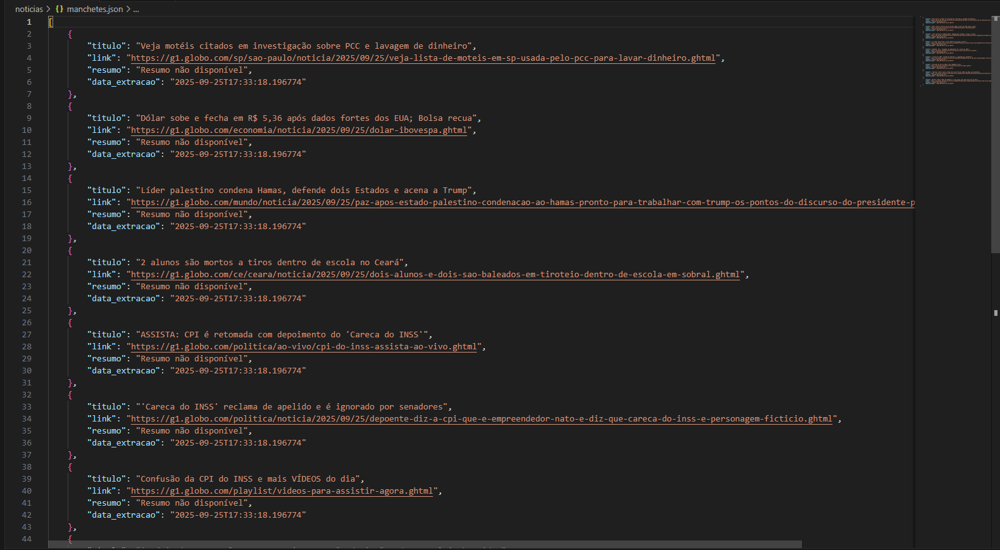
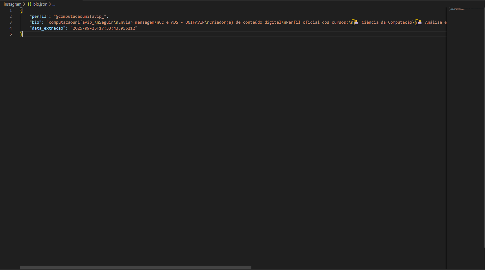

# Documentação

Projeto: Web Scraping & Automação com Selenium

👨‍💻 Autores
Nome: Maria Fernanda Barreto Romão de Farias 
Matrícula: 202208719821

Nome: Pedro Souza Alves Couto - 2022
Matrícula: 202208805991

Curso: Ciência da Computação / Algoritmo e Complexidade

Data: Setembro/2025

📌 Descrição

Este projeto contém dois scripts em Python para prática de web scraping e automação com Selenium:

1. Scraper de Notícias (`noticias/scraper_noticias.py`)
  - Extrai títulos, links e resumos do portal G1.
  - Salva os dados em um arquivo `manchetes.json`.

2. Bot do Instagram (`instagram/bot_instagram.py`)
  - Realiza login no Instagram.
  - Acessa um perfil e extrai a bio.
  - Salva os dados em `bio.json`.

🛠️ Requisitos
- Python 3.9 ou superior
- Google Chrome instalado
- ChromeDriver compatível na pasta do projeto
- Dependências listadas em `requirements.txt`

Instale as dependências com:
```bash
pip install -r requirements.txt
```

📂 Estrutura do Projeto

```
main.py
requirements.txt
instagram/
   bot_instagram.py
   bio.json
noticias/
   scraper_noticias.py
   manchetes.json
```

▶️ Como Executar os Scripts
1. Executar o Scraper de Notícias
  ```bash
  python noticias/scraper_noticias.py
  ```
  Saída esperada: Geração do arquivo `manchetes.json` contendo as manchetes extraídas.

2. Executar o Bot do Instagram
  ```bash
  python instagram/bot_instagram.py
  ```
  Saída esperada: Geração do arquivo `bio.json` com a bio do perfil.

Ou execute o menu principal:
```bash
python main.py
```

📊 Exemplos de Saída
Adicione aqui prints dos arquivos gerados (`manchetes.json` e `bio.json`).

⚠️ Observações
Este projeto é apenas para fins educacionais.

Não utilize scraping ou automação em sites que não permitem ou que contenham dados pessoais sensíveis.

Para testes de login, use sempre sites de demonstração ou contas de teste.

---

Aqui está a documentação do projeto!


# Projeto de Web Scraping

Este projeto contém dois scripts principais:

## 1. Scraper de Notícias (G1)
Extrai manchetes, links e resumos de notícias do portal G1 e salva em `manchetes.json`.

## 2. Bot do Instagram
Faz login no Instagram, acessa um perfil e extrai a bio, salvando em `bio.json`.

---

## Dependências utilizadas
- requests
- beautifulsoup4
- selenium

Instale todas as dependências com:
```bash
pip install -r requirements.txt
```

Para o bot do Instagram, baixe o ChromeDriver compatível com sua versão do Chrome e coloque na pasta do projeto.

---

## Como executar

### Menu principal
Execute:
```bash
python main.py
```
Escolha a opção desejada para rodar cada script.

### Executar individualmente
- Scraper de notícias:
  ```bash
  python ./noticias/scraper_noticias.py
  ```
- Bot do Instagram:
  ```bash
  python ./instagram/bot_instagram.py
  ```

---

## Prints dos JSON gerados

### Scraper de Notícias


### Bot do Instagram

---

## Vídeo de Demonstração

[](https://youtu.be/G1FCeJr42e0)

